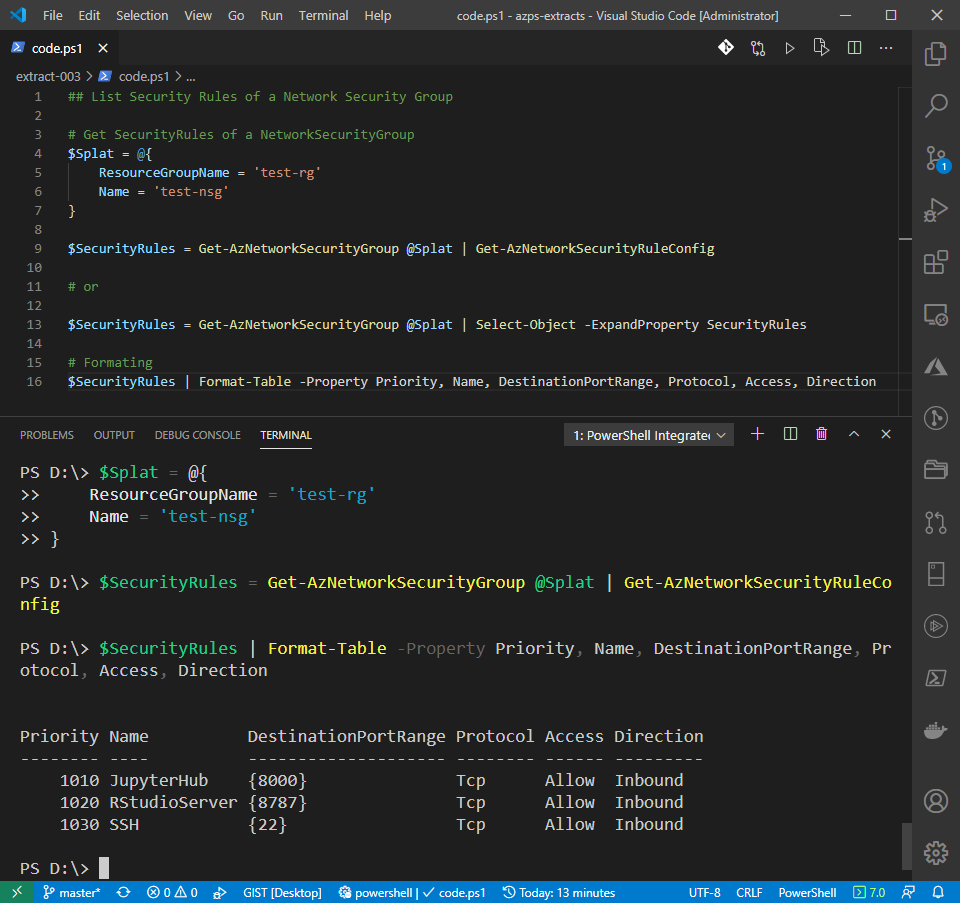

## List Security Rules of a Network Security Group

```powershell
# Get SecurityRules of a NetworkSecurityGroup
$Splat = @{
    ResourceGroupName = 'test-rg'
    Name = 'test-nsg'
}

$SecurityRules = Get-AzNetworkSecurityGroup @Splat | Get-AzNetworkSecurityRuleConfig

# or

$SecurityRules = Get-AzNetworkSecurityGroup @Splat | Select-Object -ExpandProperty SecurityRules

# Formating
$SecurityRules | Format-Table -Property Priority, Name, DestinationPortRange, Protocol, Access, Direction
```

