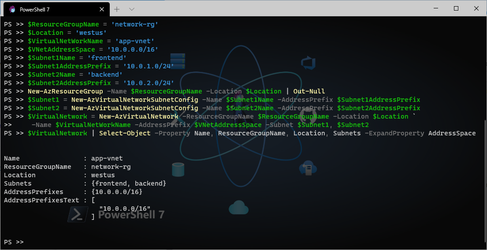

## Create Virtual Network with 2 subnets

```powershell
# Local variables
$ResourceGroupName = 'network-rg'
$Location = 'westus'
$VirtualNetWorkName = 'app-vnet'
$VNetAddressSpace = '10.0.0.0/16'
$Subnet1Name = 'frontend'
$Subnet1AddressPrefix = '10.0.1.0/24'
$Subnet2Name = 'backend'
$Subnet2AddressPrefix = '10.0.2.0/24'

# Create a resource group (if it is not created already)
New-AzResourceGroup -Name $ResourceGroupName -Location $Location | Out-Null

# Create subnet1
$Subnet1 = New-AzVirtualNetworkSubnetConfig -Name $Subnet1Name -AddressPrefix $Subnet1AddressPrefix

# Create subnet2
$Subnet2 = New-AzVirtualNetworkSubnetConfig -Name $Subnet2Name -AddressPrefix $Subnet2AddressPrefix

# Create Virtual Network
$VirtualNetwork = New-AzVirtualNetwork -ResourceGroupName $ResourceGroupName -Location $Location `
    -Name $VirtualNetWorkName -AddressPrefix $VNetAddressSpace -Subnet $Subnet1, $Subnet2 

# Format output
$VirtualNetwork | Select-Object -Property Name, ResourceGroupName, Location, Subnets -ExpandProperty AddressSpace
```

