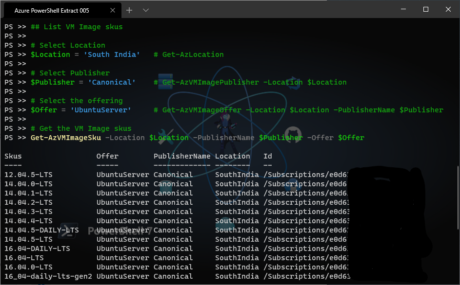

## List VM Image skus

```powershell
# Select Location
$Location = 'South India'   # Get-AzLocation

# Select Publisher
$Publisher = 'Canonical'    # Get-AzVMImagePublisher -Location $Location

# Select the offering
$Offer = 'UbuntuServer'     # Get-AzVMImageOffer -Location $Location -PublisherName $Publisher

# Get the VM Image skus
Get-AzVMImageSku -Location $Location -PublisherName $Publisher -Offer $Offer 
```

