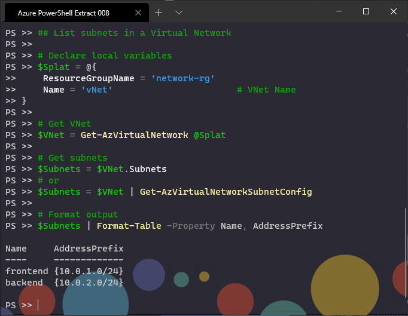

## List subnets in a Virtual Network

```powershell
# Declare local variables
$Splat = @{
    ResourceGroupName = 'network-rg'
    Name = 'vNet'                       # VNet Name
}

# Get VNet
$VNet = Get-AzVirtualNetwork @Splat

# Get subnets 
$Subnets = $VNet.Subnets
# or 
$Subnets = $VNet | Get-AzVirtualNetworkSubnetConfig

# Format output
$Subnets | Format-Table -Property Name, AddressPrefix
```

