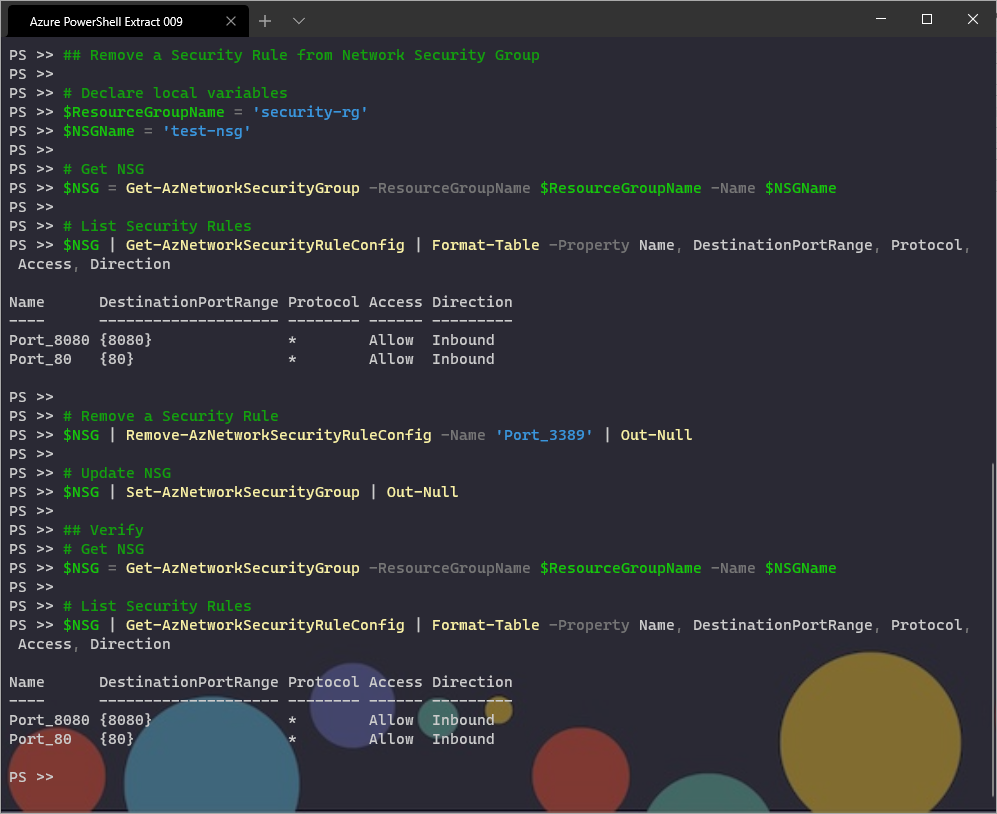

## Remove a Security Rule from Network Security Group

```powershell
# Declare local variables
$ResourceGroupName = 'security-rg'
$NSGName = 'test-nsg'                       

# Get NSG
$NSG = Get-AzNetworkSecurityGroup -ResourceGroupName $ResourceGroupName -Name $NSGName

# List Security Rules
$NSG | Get-AzNetworkSecurityRuleConfig | Format-Table -Property Name, DestinationPortRange, Protocol, Access, Direction

# Remove a Security Rule 
$NSG | Remove-AzNetworkSecurityRuleConfig -Name 'Port_3389' | Out-Null

# Update NSG
$NSG | Set-AzNetworkSecurityGroup | Out-Null

## Verify
# Get NSG
$NSG = Get-AzNetworkSecurityGroup -ResourceGroupName $ResourceGroupName -Name $NSGName

# List Security Rules
$NSG | Get-AzNetworkSecurityRuleConfig | Format-Table -Property Name, DestinationPortRange, Protocol, Access, Direction
```

