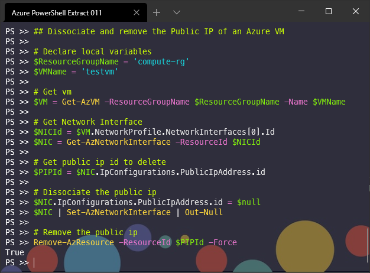

## Dissociate and remove the Public IP of an Azure VM

```powershell
# Declare local variables
$ResourceGroupName = 'compute-rg'
$VMName = 'testvm'

# Get vm
$VM = Get-AzVM -ResourceGroupName $ResourceGroupName -Name $VMName

# Get Network Interface
$NICId = $VM.NetworkProfile.NetworkInterfaces[0].Id
$NIC = Get-AzNetworkInterface -ResourceId $NICId

# Get public ip id to delete
$PIPId = $NIC.IpConfigurations.PublicIpAddress.id

# Dissociate the public ip
$NIC.IpConfigurations.PublicIpAddress.id = $null
$NIC | Set-AzNetworkInterface | Out-Null

# Remove the public ip
Remove-AzResource -ResourceId $PIPId -Force
```

