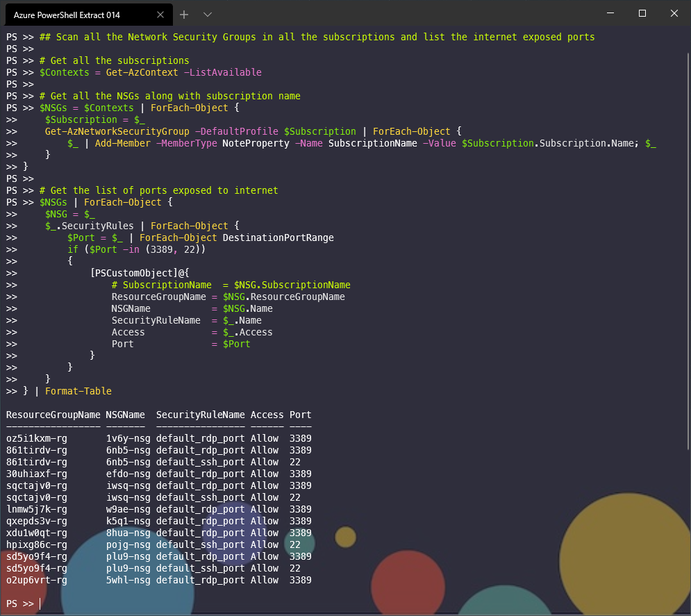

## Scan all the Network Security Groups in all the subscriptions and list the internet exposed ports

```powershell
# Get all the subscriptions
$Contexts = Get-AzContext -ListAvailable

# Get all the NSGs along with subscription name
$NSGs = $Contexts | ForEach-Object { 
    $Subscription = $_
    Get-AzNetworkSecurityGroup -DefaultProfile $Subscription | ForEach-Object { 
        $_ | Add-Member -MemberType NoteProperty -Name SubscriptionName -Value $Subscription.Subscription.Name; $_
    }
}

# Get the list of ports exposed to internet 
$NSGs | ForEach-Object {
    $NSG = $_
    $_.SecurityRules | ForEach-Object {
        $Port = $_ | ForEach-Object DestinationPortRange
        if ($Port -in (3389, 22))
        {
            [PSCustomObject]@{
                SubscriptionName  = $NSG.SubscriptionName
                ResourceGroupName = $NSG.ResourceGroupName
                NSGName           = $NSG.Name
                SecurityRuleName  = $_.Name
                Access            = $_.Access
                Port              = $Port
            }
        }
    }
} | Format-Table
```

