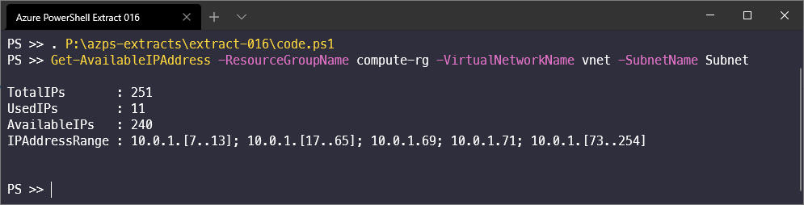

## List available Private IP Addresses in a subnet

```powershell
Function Get-AvailableIPAddress
{
    [CmdletBinding()]
    Param
    (
        # Resource Group Name
        [Parameter(Mandatory = $true)]
        [string] $ResourceGroupName,

        # Virtual Network Name
        [Parameter(Mandatory = $true)]
        [string] $VirtualNetworkName,
        
        # Subnet Name
        [Parameter(Mandatory = $true)]
        [string] $SubnetName
    )

    # Get VNet & Subnet
    $VNet = Get-AzVirtualNetwork -ResourceGroupName $ResourceGroupName -Name $VirtualNetworkName
    $Subnet = $VNet.Subnets.Where( { $_.Name -eq $SubnetName })

    # Get used IP addresses
    $NotAvailableIPs = Get-AzNetworkInterface | Where-Object { 
        $_.IpConfigurations.Subnet.Id -eq $Subnet.Id } | ForEach-Object { 
        $_.IpConfigurations.PrivateIpAddress 
    }

    # Get prefix length to find total number of IPs in a subnet and Address prefix
    $PrefixLength = $Subnet.AddressPrefix.Split('/')[-1]
    $AddressPrefix = ($Subnet.AddressPrefix.Split('/')[0]).TrimEnd('0')
    
    # Total IPs and total available IPs in count
    $TotalIPs = [math]::Pow(2, (32 - $PrefixLength))
    $TotalAvailableIPs = $TotalIPs - 5 # Remove Azure reserved IPS

    # Get remaining IP addresses count
    $RemainingIPs = $TotalAvailableIPs - $NotAvailableIPs.Count

    # Find remaining IP Addresses
    $Octet4 = $NotAvailableIPs | ForEach-Object { $_.split('.')[-1] }
    $IPRange = 4..$TotalIPs | Where-Object { $_ -notin $Octet4 -and $_ -lt 255 }

    # Convert list of available IP addresses to IP addresses range
    $StartIP = $IPRange[0]
    $EndIP = $IPRange[-1]

    $AvailableIPAddresses = @()

    for ($i = 1; $i -lt $IPRange.Count; $i++)
    {
        $NumDiff = $IPRange[$i] - $IPRange[$i - 1]
        if ($NumDiff -ne 1)
        {
            $AvailableIPAddresses += [PSCustomObject]@{ StartIP = $StartIP; EndIP = $IPRange[$i - 1] }
            $StartIP = $IPRange[$i]
        }
        if ($IPRange[$i] -eq $IPRange[-1])
        {
            $AvailableIPAddresses += [PSCustomObject]@{ StartIP = $StartIP; EndIP = $IPRange[$i] }
        }
    }

    if ($AvailableIPAddresses.Count -eq 0)
    {
        $AvailableIPAddresses += [PSCustomObject]@{ StartIP = $StartIP; EndIP = $EndIP }
    }

    # Get IP addresses with Addresses prefix
    $IPAddresses = @()

    $IPAddresses = foreach ($IPAddress in $AvailableIPAddresses)
    {
        if (($IPAddress.StartIP - $IPAddress.EndIP) -eq 0)
        {
            "{0}{1}" -f $AddressPrefix, $IPAddress.StartIP
        }
        else 
        {
            "{0}[{1}..{2}]" -f $AddressPrefix, $IPAddress.StartIP, $IPAddress.EndIP    
        }
    }

    $IPAddresses = $IPAddresses -join '; '

    # Output
    return ([PSCustomObject]@{
            TotalIPs       = $TotalAvailableIPs
            UsedIPs        = $NotAvailableIPs.Count
            AvailableIPs   = $RemainingIPs
            AvailableIPAddressRange = $IPAddresses
        } | Format-List )
}
```

